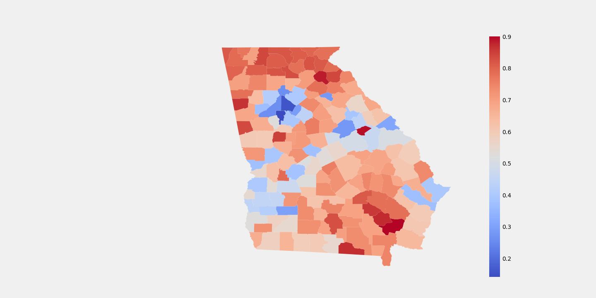
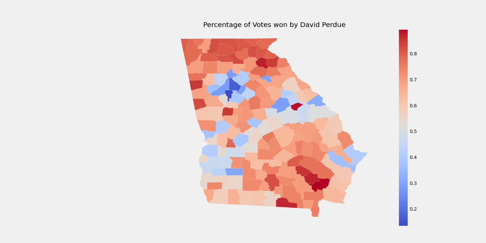
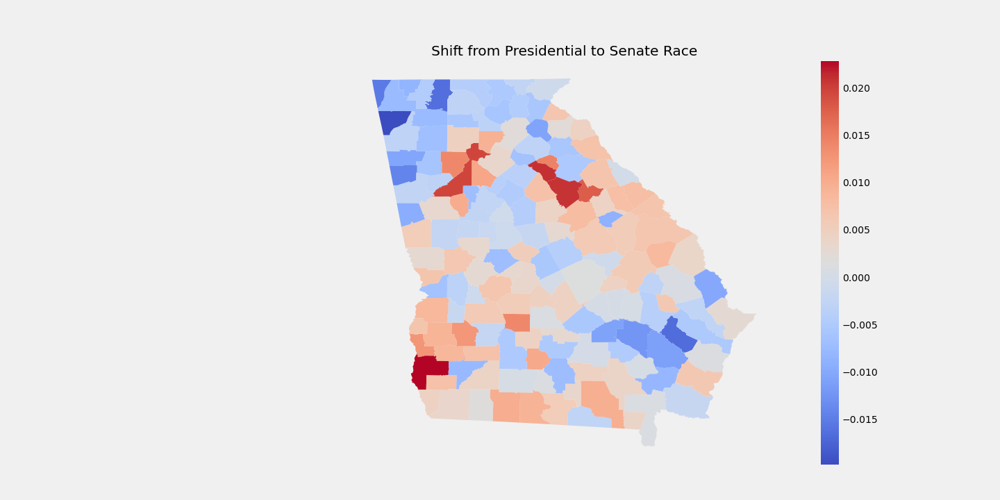
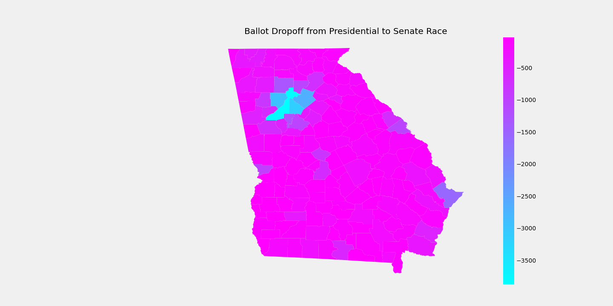

# Georgia Voter Registration Project

This repository contains data from every every midterm and general election held since 2010. All data come from the [Georgia Secretary of State](https://sos.ga.gov/), and is publicly available. The goal of this repository is to identify racial disparities within voting trends in the State of Georgia and use statistical methods to measure the change in these voting trends over time. There are also shapefiles taken from public ArcGIS pages from counties, and the US Census Bureau. County level population and demographic statistics are also provided by the US Census Bureau. Citations will be included at the bottom of the page as more work is done, and we are closer to release of any analysis. All code is intellectual property of the UGA Data For Good Team working on the Data and Discrimination Project. Code may be downloaded and used as long as proper credit is given to the team. All data is public domain. 

## Working With Election Data

Every election is different so how do we identify trends in data and make definitive statements about heavy subjects such as voter suppression, ballot drop-off, and voter roll purges? How can we hope to compare across different elections with vastly different turnouts across many diverse counties of Georgia? The first key aspect to understand is the various numbers involved leading up to and on election day. 

- Citizen Voting Age Population (CVAP), based on Census Bureau data and a direct measure of how many people in a given population are above 18 and citizens of the United States. 
- Voting Eligible Population (VEP), we will need to find this number ourselves by removing dis-enfranchised people from the CVAP. This may include felons who have not applied to have their right to vote instated and those judged mentally incapacitated. Careful analysis of Georgia Law will be required to determine this number, and most likely we will only be able to estimate this number rather than have a nice table filled with this number by demographic and county. 
- Voter Turnout (VT), this can be generated as ratio of the number of people who voted over the CVAP or VEP. VEP is preferred to generate voter turnout as a proportion. 
- Registered Voters (RV), the number of people registered to vote for a particular election. This number is easy to find, incredibly hard to analyze. Many voter rolls include "deadwood" rolls of people who have died or moved out of state. This concept is especially important to Georgia, where in 2018 when former Secretary of State Brian Kemp purged voter rolls in mass numbers right before the election under the cover of removing deadwood. Nearly 50,000 people were turned away from the polls as a result of these voting roll purges. Analyzing Registration trends and how deadwood is removed in the State of Georgia is of high importance to our team. 
- VT/RV, we can generated a ratio of how many people voted in comparison to how many registered. This number may be important for various organizations who work to increase turnout through registration. Analyzing the relationship between RV and VT will be interesting, and important information. Seeing how this varies across elections may be interesting. 

Election data is highly complex (it's almost like people dedicate their entire lives to it), and analyzing it a unique problem as it changes to drastically from election to election. Many papers try to control for this variation by using all white people as a controlling variable. The basic assumption is that we can control for overall increased or decreased turnout caused by that years specific political climate. This would look like [Specific Demographic] - [Overall White VT] for every given year. We may even be able to assemble some sort of reasonable panel data using this approach. 

## Visualizing Election Data

Election data is complicated to wrap your head around, but we can get a good feel for data by using choropleth maps. The name sounds mysterious, but a choropleth is constructed using borders and various colors. This is why we have shapefiles in this repository. All maps were created using the GeoPandas library. 

Here we have an example of 2020 presidential results. The proportion in this is the proportion of votes that Donald Trump won, we can see that in Dekalb County he only won around 10% votes leaving the lions share for Joe Biden. 

Here we have the Percentage of votes won by David Perdue, it looks like almost the exact same map as above. This highlights the weakness of the choropleth map: it can't provide us with perfect exact information. This is unfortunate as there is no other easy way to visualize election data in a way that makes sense without giving up granularity. Looking at bars of 159 counties would be no more helpful than this map. The reality is that David Perdue won more votes than his democratic opponent Jon Ossoff whereas the same cannot be said for Trump. 

This shift is captured and visualized and we find that many counties shifted red down ballot including some of Georgia's bluest and most populous counties. Note that this is not an absolute proportion, but rather the proportion of votes that flipped down-ballot. David Perdue did not win Fulton, he just won around 0.02% more votes in Fulton county than Trump. This matters quite a lot when we consider that Biden's win over Trump was only 0.03% and we see that this shift around Georgia Down Ballot made all the difference for Senator Perdue. 

**Ballot Drop-off**

Analyzing Ballot Drop-off will be key to understanding why down-ballot candidates did not perform as well as the president elect and how to increase down ballot wins. 

## Viewing Data

All data is available through the data folder, however this may not be the most efficient way to view this data. Shapefiles can only be viewed by a program than can open and process .shp files. Most election data is available in as .csv or .xlsx format which is viewable in excel or google sheets (although larger files may be difficult to process). It is recommended that data is observed through the SQLite database found in the sql_database/ folder. Here are a few easy steps to view .db files. 

1. Consult [this tutorial](https://www.sqlitetutorial.net/download-install-sqlite/) to download and install SQLite. 
2. Install the [SQLite DB Browser ](https://sqlitebrowser.org/)

That's it! Now you can start viewing our cleaned and processed data with a nice interface, and a powerful tool. We use SQLite to hold our data simply not because of the amount of data we have, but the variation in the type of data we have. There are multiple tables that we need to combine and process in many different ways, SQLite allows us to create a portable relational database and query it on our local machines. This is much cheaper than creating a SQL Server and much faster than trying to use Pandas and Excel to create our own relational database functionality for our purpose. 

## Additional Reading

[Open Election Data Academy](https://openelectiondata.net/en/academy/) - Want to analyze this data yourself, but don't know how to code? Well here is a course on analyzing election data in excel. If you want to apply this course to our data substantial data cleaning and transformation will be needed, but we're working on getting that you over the next few months. 

[MIT Election Lab](https://electionlab.mit.edu/) - Learn how to analyze data, read research about voter registration and turnout and download datasets of election data from all around the country. 

## Citations 

*COMING SOON*

